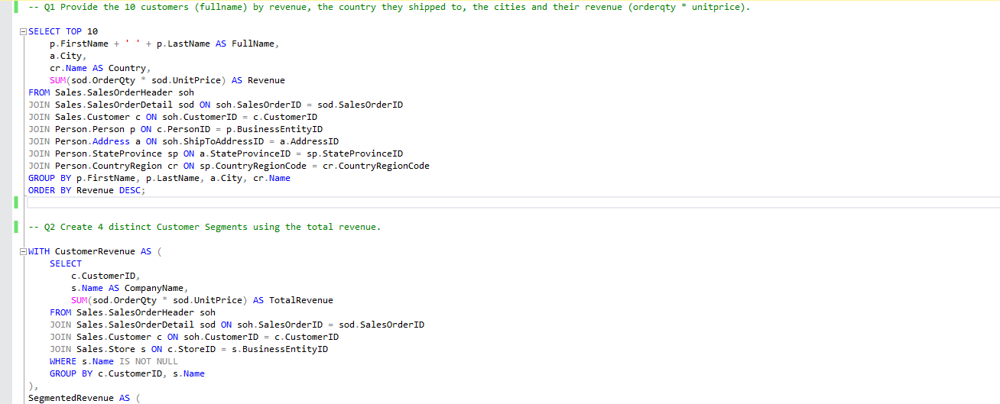
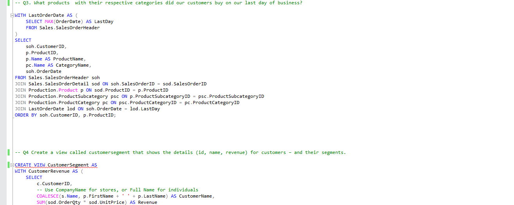

# Iyke's_Portfolio
### [Project 1: Querying the AdventureWorksLT2012] (https://github.com/ogumbaiyke/Querying-the-AdventureWorks2012-DB)

In this project, I queried the AdventureWorksLT2012 database on my local computer to answer business questions and retrieve business insights. My task was to write efficient SQL queries that extract meaningful information and showcase how the data can be used for decision-making. 

### Tasks
* Carefully going through the business questions that needed to be answered using SQL queries. 
* Query the AdventureWorks2012 Database ensuring that l use proper SQL techniques such as JOINS, GROUP BY, ORDER BY, WHERE conditions, and aggregate functions when necessary. 
* Formating the queries. 
* Combine all queries in one file.
* Submission of work.

### Overview

